# __Airbnb Data Cleaning Project__

Cleaned an Airbnb data set containing 102,599 rows and 26 columns using Pandas. The data set includes Nulls, True/False, lowercase and uppercase, columns that were not needed, and symbols. Removed 8 columns and around 3,000 rows after cleaning the data set. 

---

## Table of Contents
- [Introduction](#Introduction)
- [Dropping Columns](#Dropping-Columns)
- [Renaming Columns](#Renaming-Columns)
- [Duplicates](#Duplicates)
- [Nulls](#Nulls)
- [Cleaning Data](#Cleaning-Data)
- [Conclusion](#Conclusion)

---

## Introduction

Found this Airbnb data off of Kaggle, wanted to test my ability to clean data properly using pandas. First I imported pandas as pd and then imported my data set as data. After that I did data.head() to ensure it was the correct data and so that I could see exactly what I needed to change. Looking at this image shows me that I need to get rid of $, some columns are all capitalized and others are not, and I see Nulls. 
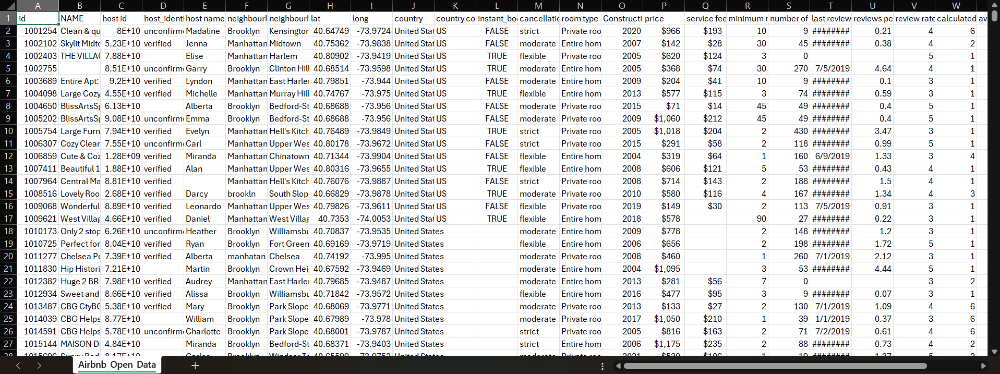 
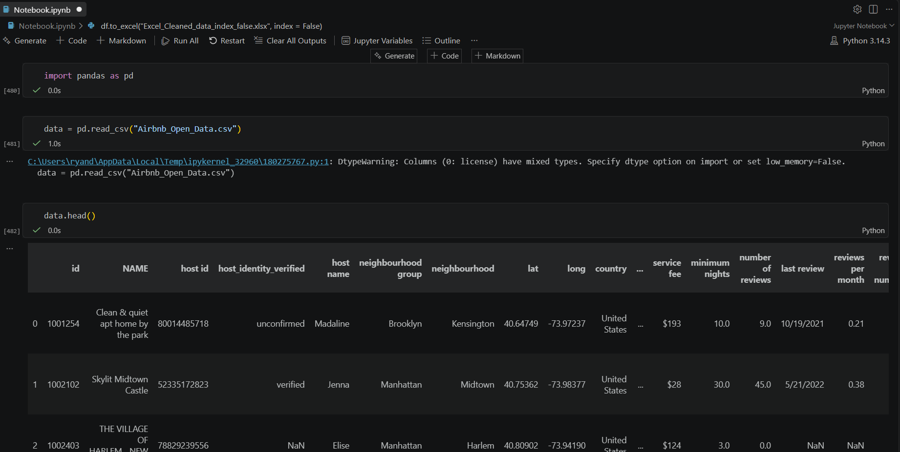

---

## Dropping Columns

First I looked at all the column names and then I looked to see how many null values each column had. 
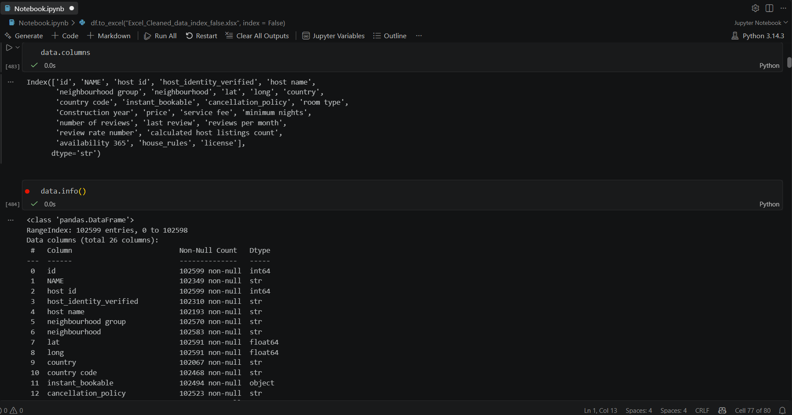
I noticed that the column 'License,' only had 2 non-null values and the column 'house_rules' had over 50,000 nulls, therefore I dropped those column as they are basically useless. 
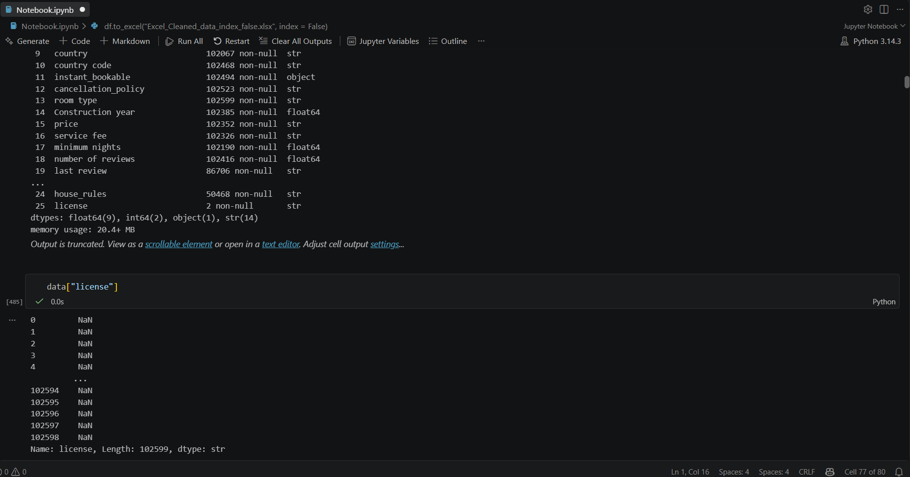
Then I created 2 lists of columns to keep and columns to drop. I dropped the column 'id' because it has no analytical value as it is just an identifier code that distinguishes rows. I dropped 'reviews per month' and 'review rate number' because they are redundant review columns considering I am keeping 'number of reviews' and 'last review.' I dropped 'calculated host listings count' because it is redundant with the other host columns that I kept. And finally I dropped 'availability 365' because it could contain extreme outliers as it could be available 0 days or 365 days. 
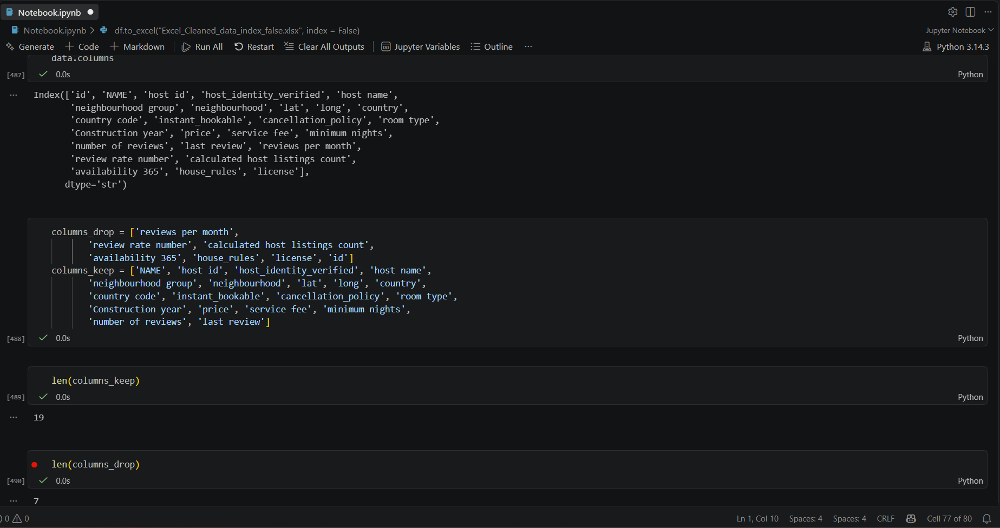
Then I made df my data set without the dropped columns. 
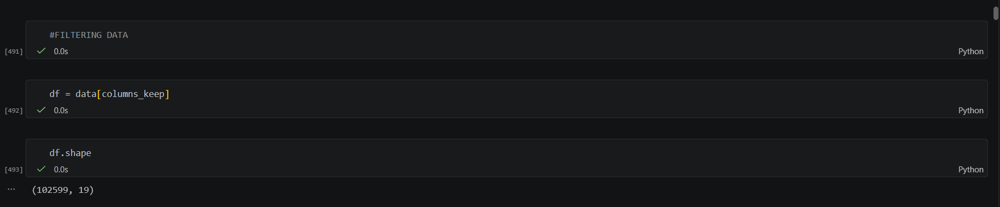

---

## Renaming Columns
First I looked at all the column names and decided that I wanted to make them all uppercase. 
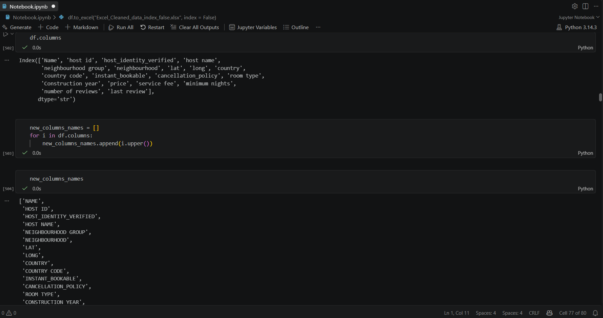
Then I checked and made sure that df includes all uppercase columns now. 
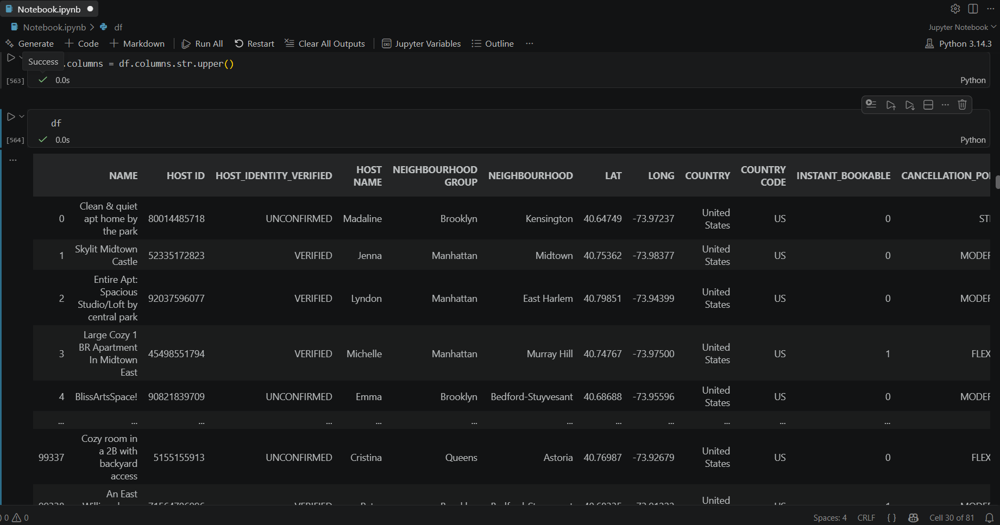

---

## Duplicates

In order to figure out how many duplicates there were in this data set, I did df.duplicates().sum() and found that there are 541 duplicates. Then I did df.drop_duplicates(inplace = True), so that it drops all the duplicates from the data set df. Finally, I checked to see if my data set had anymore duplicates and it did not. 
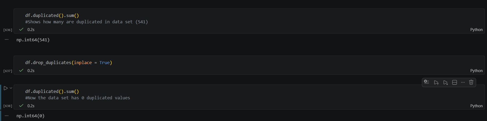

---

## Nulls

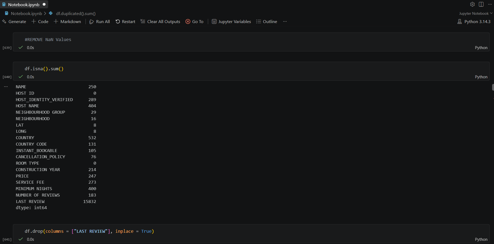
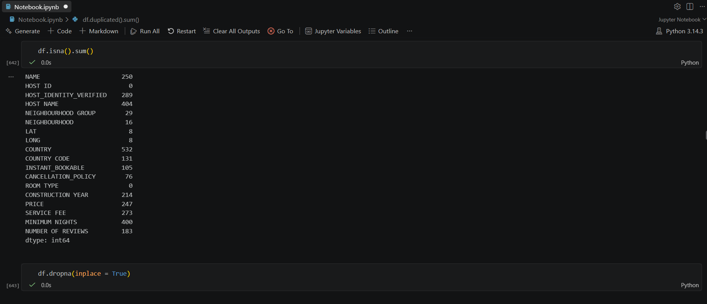
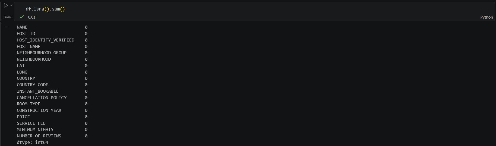
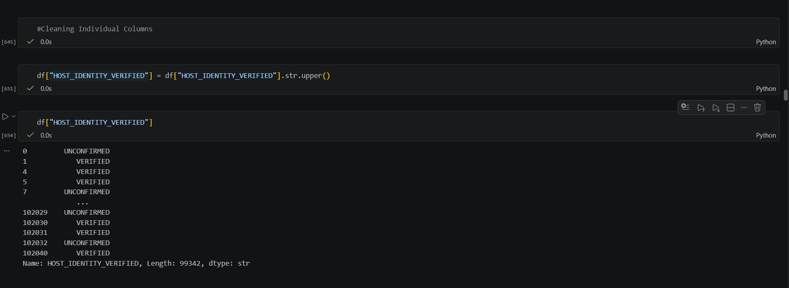

---

## Cleaning Data

---

## Conclusion
