# __Airbnb Data Cleaning Project__

Cleaned an Airbnb data set containing 102,599 rows and 26 columns using Pandas. The data set includes Nulls, True/False, lowercase and uppercase, columns that were not needed, and symbols. Removed 8 columns and around 3,000 rows after cleaning the data set. 

---

## Table of Contents
- [Introduction](#Introduction)
- [Dropping Columns](#Dropping-Columns)
- [Renaming Columns](#Renaming-Columns)
- [Duplicates](#Duplicates)
- [Nulls](#Nulls)
- [Cleaning Data](#Cleaning-Data)
- [Conclusion](#Conclusion)

---

## Introduction

Found this Airbnb data off of Kaggle, wanted to test my ability to clean data properly using pandas. First I imported pandas as pd and then imported my data set as data. After that I did data.head() to ensure it was the correct data and so that I could see exactly what I needed to change. Looking at this image shows me that I need to get rid of $, some columns are all capitalized and others are not, and I see Nulls. 
 

---

## Dropping Columns

First I looked at all the column names and then I looked to see how many null values each column had. 

I noticed that the column 'License,' only had 2 non-null values and the column 'house_rules' had over 50,000 nulls, therefore I dropped those column as they are basically useless. 

Then I created 2 lists of columns to keep and columns to drop. I dropped the column 'id' because it has no analytical value as it is just an identifier code that distinguishes rows. I dropped 'reviews per month' and 'review rate number' because they are redundant review columns considering I am keeping 'number of reviews' and 'last review.' I dropped 'calculated host listings count' because it is redundant with the other host columns that I kept. And finally I dropped 'availability 365' because it could contain extreme outliers as it could be available 0 days or 365 days. 

Then I made df my data set without the dropped columns. 

---

## Renaming Columns

First I looked at all the column names and decided that I wanted to make them all uppercase. 

Then I checked and made sure that df includes all uppercase columns now. 

---

## Duplicates

In order to figure out how many duplicates there were in this data set, I did df.duplicates().sum() and found that there are 541 duplicates. Then I did df.drop_duplicates(inplace = True), so that it drops all the duplicates from the data set df. Finally, I checked to see if my data set had anymore duplicates and it did not. 

---

## Nulls

In order to remove the Null values, first I wanted to see how many Null values each column had. Then I decided to drop the column 'LAST REVIEW' as it had 15,000 Null values which is way too many.

Here I confirmed that the column 'LAST REVIEW' had been dropped and then I dropped all Null values from my data set.

Finally I confirmed that all the Null values had been dropped. 

---

## Cleaning Data

First thing I wanted to do was make the data in column 'HOST_IDENTITY_VERIFIED' uppercase. 

Then I made the data in column 'CANCELLATION_POLICY' uppercase as well. 
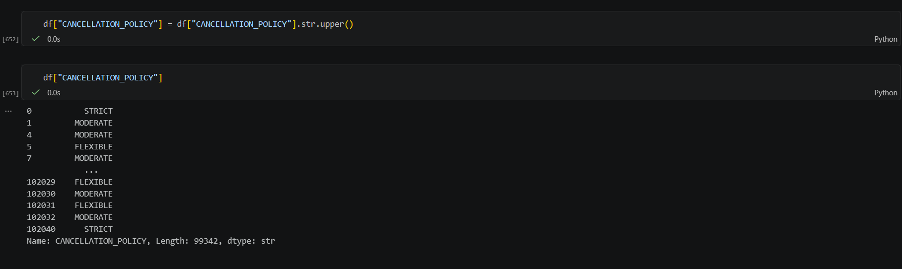

For True and False columns like 'INSTANT_BOOKABLE', I wanted to make it say 1 if True and 0 if anything else. I did this because most ML models like linear regression, require numerical inputs. 
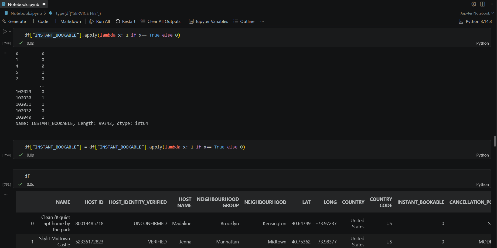

Previously, the index would go from 1 to 4 because I got rid of some rows due to Null values. As a result, I reset the index so that it counts correctly. 
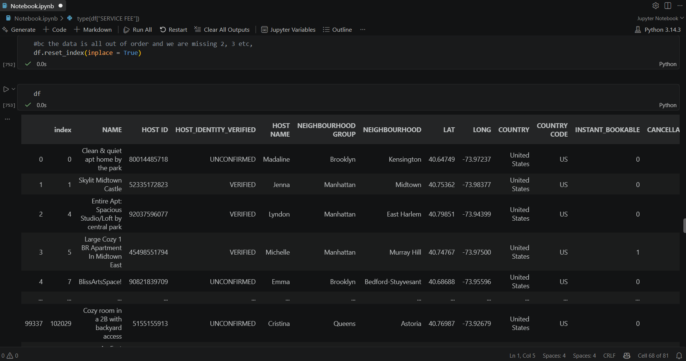

The column 'PRICE' has $ signs, so I got rid of them so that it could eventually be an integer instead of a string. 
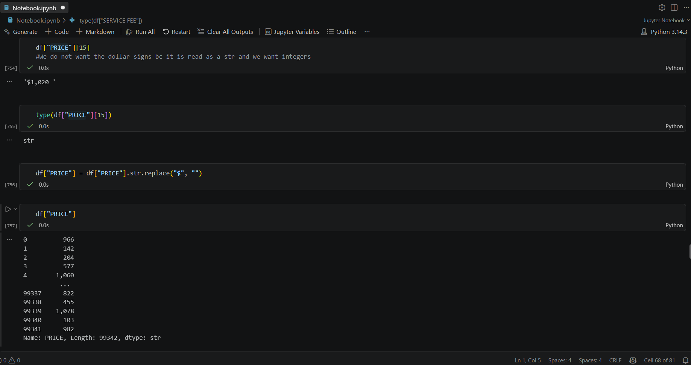

Here I got rid of the commas and the spaces in the column 'PRICE'. 
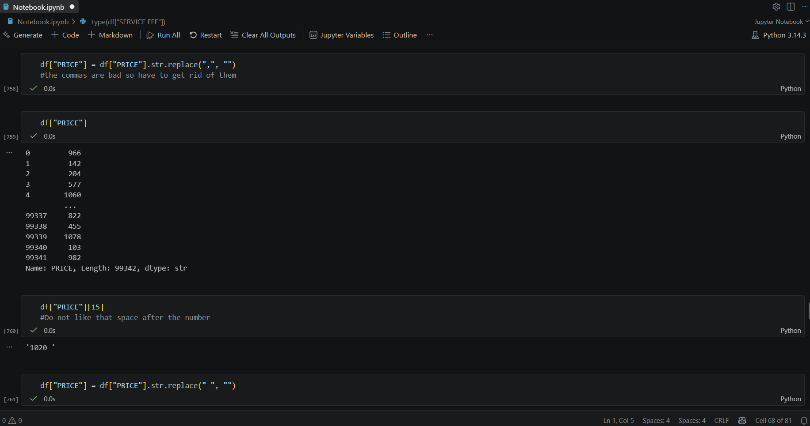

Finally, the column 'PRICE', is just a number, however it is still a string. 
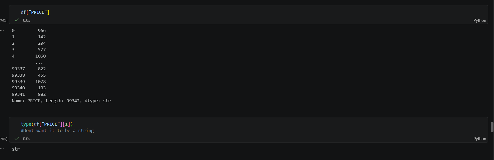

Here I converted the column 'PRICE' from a string to an integer, and also realized I have to do the same thing with the column 'SERVICE FEE'.
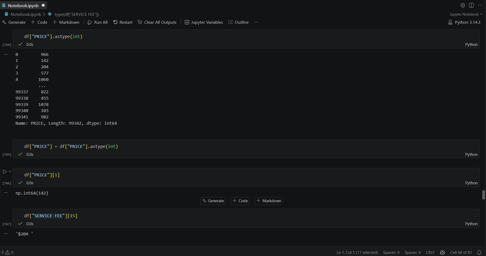

Got rid of the $ sign, the space, and figured out that the column 'SERVICE FEE' is a pandas.Series. As a result, I switched it to an integer. 
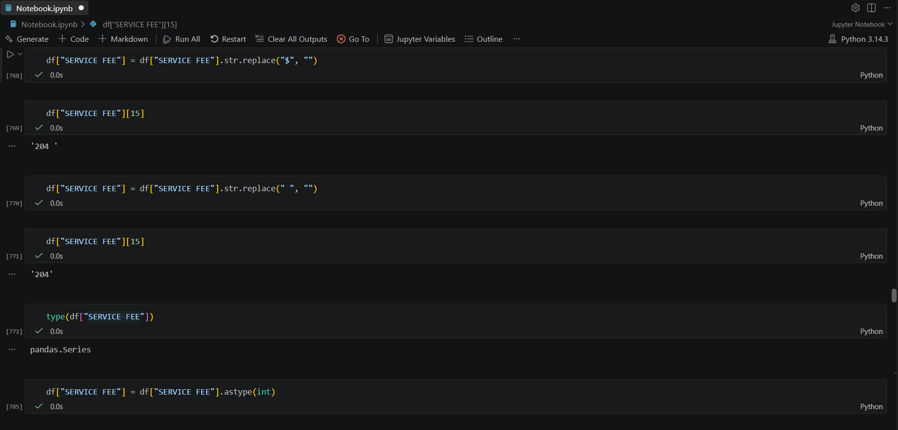

---

## Conclusion

Here is the original data set. 
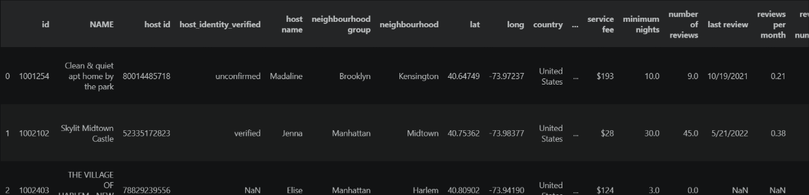

Here is the cleaned data set. Although you can not see all the columns of the original data set, there was 26 columns, now there is 18 after removing Nulls and repetitive columns. Now the column names are all uppercase and there are no more symbols like $. I also changed the True/False to 0 and 1s, and changed some columns data to all uppercase. 
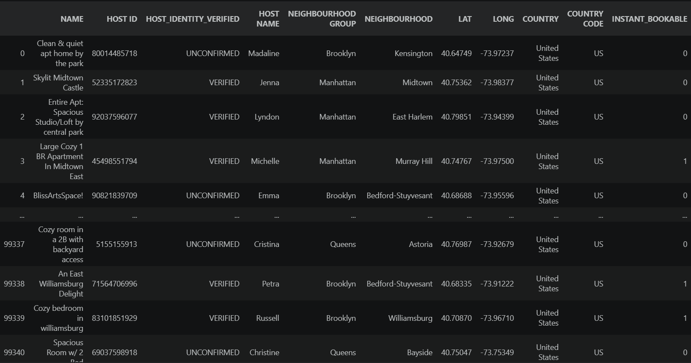
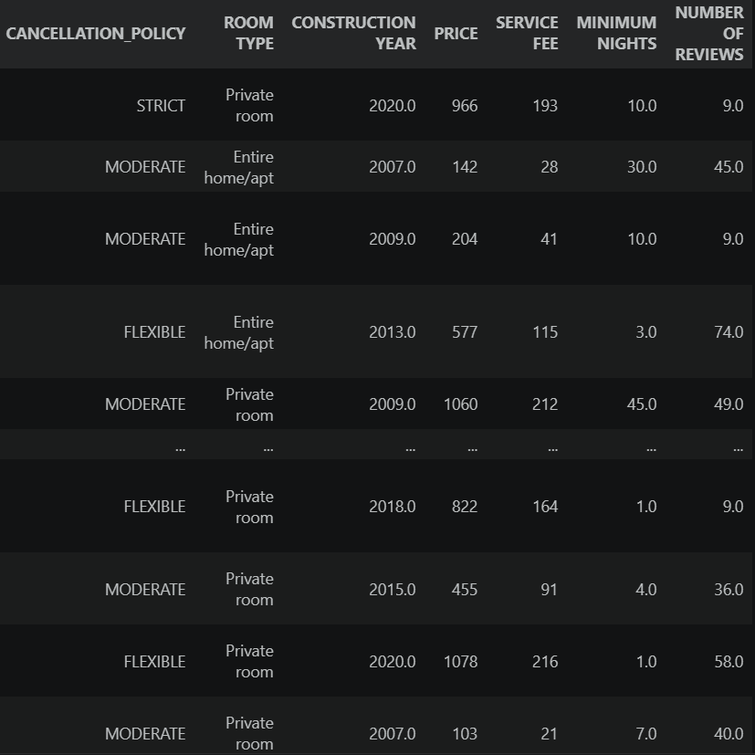

From this project I taught myself how to use pandas in python and learned a lot about data cleaning. Using this in the future, I hope to clean a data set and then perform statistical analysis on a data set. 
