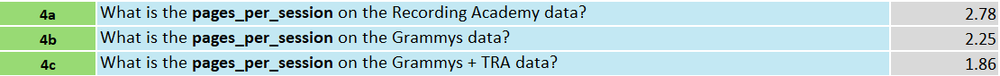
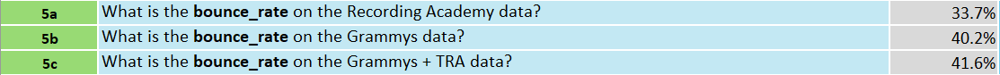
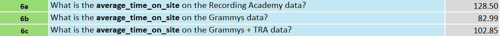

# __Grammys Website Performance__

For this project I analyzed whether splitting the Grammys website into two has improved user engagement. The first website had both the Grammy's and the Recording Academy's information while the new website has just the Grammy's information and the Recording Academy has a different website. 

---

Table of Contents

- [Daily Visitors](#Daily-Visitors)
- [Key Metrics](#Key-Metrics)
- [Devices](#Devices)
- [Conclusion](#Conclusion)
- [Data](#Data)

---

# Daily Visitors

After making the daily visitors line chart, I realized that around once or twice a year the daily visitors shoots up creating a spike look to the graph. The massive spikes occur when the Grammy's host their awards show night while the smaller spikes occur when the Grammy's host lesser known events. The average website visits on a regular day is around 32,000 visitors while the average visitors on a Grammy Award day is around 1.4 million visitors.

---

# Key Metrics

### Pages Per Session

First I calculated the pages per session as this is very important to know if users are more or less engaged. The pages per session before splitting the website was 1.86, while after splitting the website, the Recording Academy had 2.78 pages per session and the Grammy's website had 2.25 pages per session. This shows that splitting the websites was very beneficial as both the pages per session on different websites were higher than that of the combined website.

### Bounce Rate

The bounce rate is what percentage of the users that come to the website, never interact, and leave. This is important because it shows how interactive the visitors are with the home page of the website. The bounce rate of the combined websites were 41.6%, while the bounce rate for the Recording Academy was 33.7% and the Grammy's was 40.2%. That means splitting the website was beneficial because less people left the websites without interacting after the split. 

### Average Time on Site

The average time on site is important because it measures how engaging your website is for your users. Before splitting, the website had an average of 102.85 seconds on the website, while after splitting the Recording Academy had an average of 128.50 seconds on the website and the Grammy's website had 82.99 seconds on the website. The reason the combined website has more time than the split Grammy's website is because the Recording Academy's information is a lot more viewer engaging and it is on the combined website as well, so it makes sense for the Grammy's separate website to be so low compared to the combined website and the separate Recording Academy website. Even though the combined website is second in average time on site, I believe it is better to keep the websites separate because of the Recording Academy's increase in average time on site. 

---

# Devices

Found the percentage of visitors on mobile devices because a higher percentage might affect the numbers from the Key Metrics section. This is because mobile users generally have shorter attention spans than desktop users. The percentage of mobile visitors on the website was 73.7%. This informs me that the average time on site is decreased because of mobile users and the bounce rate is increased on all websites because of mobile users. 

---

# Conclusion

After analyzing the combined website's data and the split up websites' data, Grammy's should not recombine their Recording Academy website and their Grammy website. After splitting the websites, pages per session increased by 20.97% on the Grammy website and increased by 49.46% on the Recording Academy Website. The bounce rate for both individual websites decreased, meaning less people left their website without interacting. The Recording Academy' website after the split flourished with an increase of 24.94% average time spent on site, while the Grammy's website decreased in average time spent on website by 19.31% after the split. Although there is less time spent on the Grammy's website alone, the benefit of the Recording Academy's website proves why staying separate is the right move. 

# Data

### [Excel Sheet](../docs/Grammy%20Project%20Excel.xlsx)
