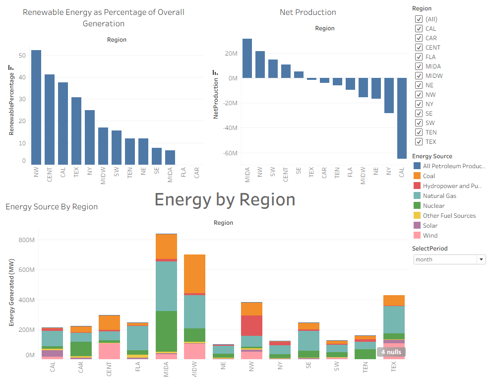
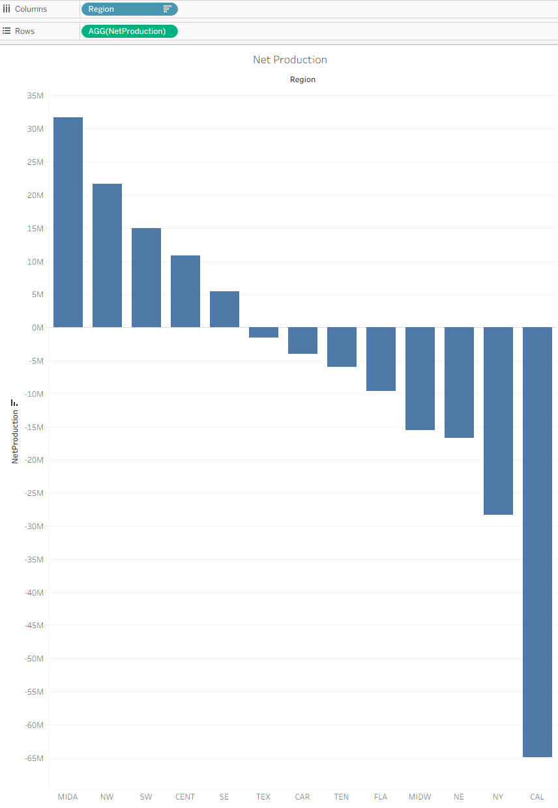
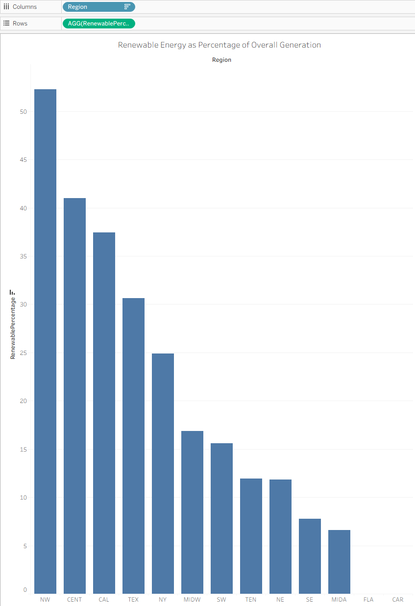
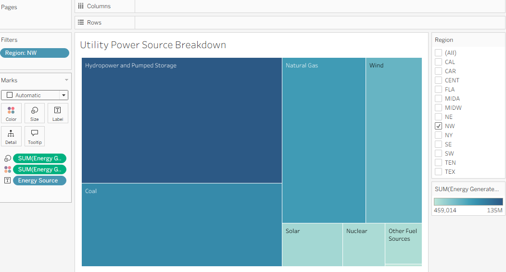
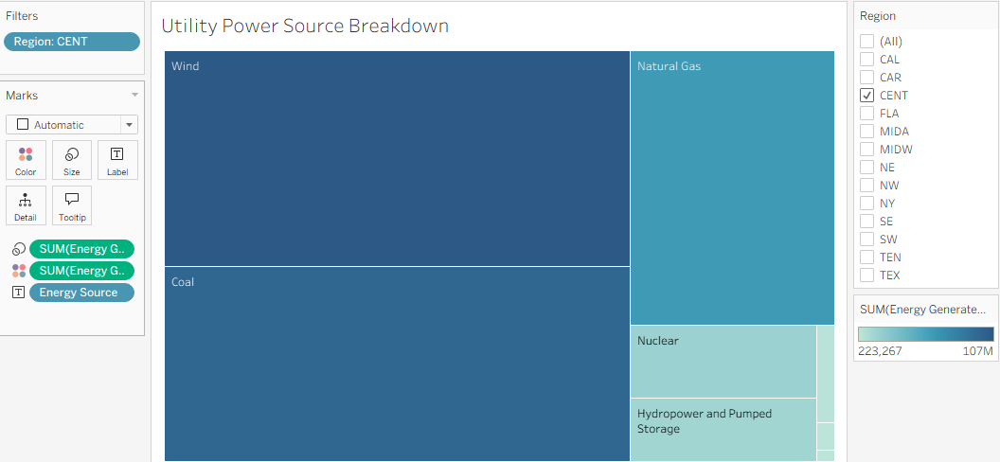

# __Intel Energy Project - Tableau__

Analyzed regions using energy source, renewable energy, and net production data to help the Intel team select the best location for their new data center. Tableau project - bar charts, line charts, and tree maps. 

---

## Table of Contents

- [The Prompt](#The-Prompt)
- [Net Production](#Net-Production)

---

## The Prompt

Intel, the semiconductor manufacturing powerhouse, is planning on building a new data center. Energy availability and usage are some of the key factors in deciding on a location of the data center. For example, which regions produce a surplus of energy? Which regions rely more on renewable energy sources?

---

## Net Production

I found the net production of energy per region and found that only 5 regions have positive net production of energy, Mid Atlantic, North West, South West, Central, and South East with the Mid Atlantic having the best net production of energy. Therefore, I know one of these 5 regions will be the best region to build the new data center. 

---

## Renewable Energy

I created a bar chart showing the percentage of renewable energy in each region. This is important because the more renewable energy, the more sustainable and data center will be. The North west, Central, and California are the regions with the highest percentage of renewable resource energy generation. 

---

## Utility Power Source Breakdown

I created a tree map to show where the renewable energy was coming from in each region. This is important because some renewable resource are not as reliable as others. For example, wind not as reliable as hydropower because wind can go away or become weaker, while hydropower almost never stops. I centered in on two regions as they both were positive in net production and had a high percentage of renewable energy. After reviewing these two diagrams I found that the North Western region was more reliable than the central region because it has a more reliable renewable resource, hydropower and pumped storage. 

## North Western Region

## Central Region

---

## Conclusion

After analyzing the net production, percentage of renewable energy, and power source breakdown, Intel should make their next data center in the North Western region. This is because it has the second highest net production, the highest renewable energy percentage, and it has very reliable renewable energy sources.

